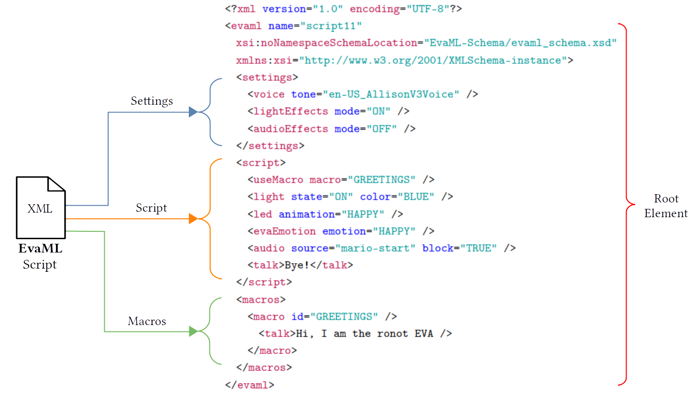

# EvaML - Document Sections

We can see in the next figure an EvaML script that shows the document root element `<evaml>`, with its `name`
attribute that defines the script name, and which contains the following three elements: the `<settings>`, `<script>`
and `<macros>`.


<div style="text-align: center;"><b>Figure</b>: EvaML - Document Sections</div><br>


The following table shows the root element of the EvaML document (`<evaml>`) and the elements `<settings>`, `<script>` and `<macros>` that represent the sections of the document. You can also observe the attributes of each element and its contents. In the attribute **column**, an underlined attribute indicates that it should be used. In the column of **contents**, occurrence indicators are used to indicate the order and number of times an element can occur. The "," (comma) symbol indicates that all child elements listed must be used in the sequence shown. The "|" (pipe bar) indicates that either element can occur within the parent element. The "+" (plus sign) symbol, on the other hand, indicates that the child element must appear one or more times. The "*" (asterisk) symbol indicates that the element may be used zero or more times within the parent element. The "?" (question mark) indicates that the element is optional, the element may not exist or there is only one occurrence of it.

<table class="commands">
  <tr>
    <th><b>Element</b></th>
    <th><b>Attributes</b></th>
    <th><b>Content</b></th>
  </tr>
  <tr>
    <td>evaml</td>
    <td><u>name</u></td>   
    <td>(settings, script, macros?)</td>
  </tr>
  <tr>
    <td>settings</td>
    <td></td>
    <td>(voice | lightEffects? | audioEffects?)</td>
  </tr>
  <tr>
    <td>script</td>
    <td></td>
    <td>(random* | wait* | talk* | stop* | light* | goto* | motion* | loop* | userEmotion* | evaEmotion* | useMacro* | listen* | audio* | led* | counter* | switch*)</td>
  </tr>
  <tr>
    <td>macros</td>
    <td></td>   
    <td>(macro+)</td>
  </tr>
</table>
<p style="text-align: center;"><b>Table</b>: EvaML - Document Elements (Root and Main Elements)</p>


## Settings Section

In this section, some global characteristics of the script are defined in the `<settings>` element. It is possible to define how the voice tone and the language in which the robot will communicate. It is also possible to define whether the generated code will perform light effects, sound effects or even play music. By configuring
these parameters, it is possible to globally modify the operation of the script without having to directly change the definitions of its individual elements. Here is an example from the `<settings>` element.

<!-- hl_lines="2 3" -->
```xml title="settings_example.xml" linenums="0"
<settings>
    <voice tone="en-US_AllisonV3Voice" />
    <lightEffects mode="ON" />
    <audioEffects mode="ON" />
</settings>
```


## Script Section

The `<script>` section contains the sequence of commands that the robot must execute. We can see some of them on following code snippet. We can see in line 2 of the script, the `<light>` command that lights the smart bulb setting its color to blue. Next we have the `<talk>` command, which makes the robot say something, for example, introducing itself. The `<wait>` command on line 4 causes the script to pause for 2000 ms (2s). In the next line, the `<audio>` command plays an audio file named "mario-start". Then the robot speaks "Bye" and turns off the smart bulb.

<!-- hl_lines="2 3" -->
```xml title="script_example.xml" linenums="1" hl_lines="2 4" 
<script>
  <light state="ON" color="BLUE" />
  <talk>Hi, I am robot EVA</talk>
  <wait duration="2000" />
  <audio source="mario-start" block="TRUE" />
  <talk>Bye</talk>
  <light state="OFF" />
</script>
```


## Macros Section

The `<macros>` section is one of the abstractions created in the EvaML language. As you can see in the next code snippet, it is possible to create macros that can be referenced within the `<script>` element. A macro has the `id` attribute that serves to identify it. These macros can be used within the `<script>` section using the `<useMacro>` command. The `macro` attribute of the command `<useMacro>` references the `<macro>` element defined in the `<macros>` section. During the parsing process of the EvaML document, macros are expanded with their code in the `<script>` section. There is no limit to the number of macros created, nor to the number of references to these macros within the script. As can be seen in the table above, the `<macros>` section is not mandatory.

<!-- hl_lines="2 3" -->
```xml title="macros_example.xml" linenums="0" 
<script>
  <useMacro macro="START" />
</script>
<macros>
  <macro id="START">
    <talk>Hello, I'm robot Eva. I'll pick a number from one to four</talk>
    <talk>For each one, I'll turn the bulb on in a different color</talk>
    <talk>I will only terminate when the number drawn is three</talk>
  </macro>
</macros>
```